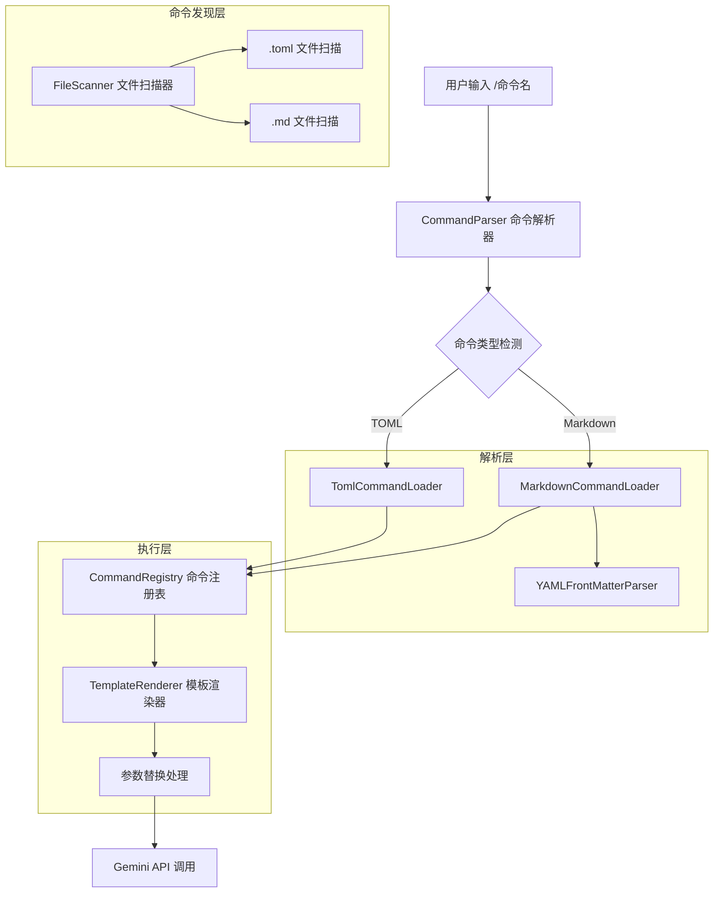
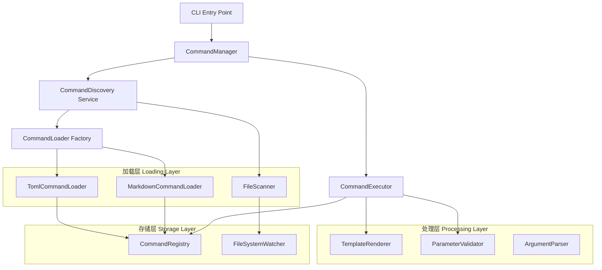
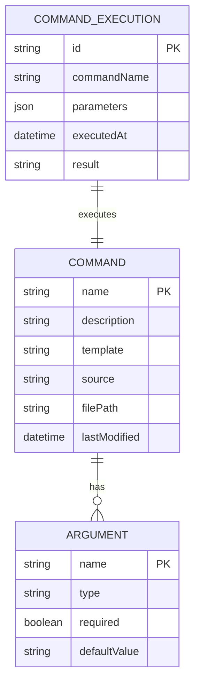

## 1.架构设计



## 2.技术描述

- Frontend: 无（CLI 工具）
- Backend: Node.js + TypeScript
- 核心依赖: gray-matter@4 (YAML Front Matter 解析), marked@5 (Markdown 解析)
- 现有框架: 基于现有 gemini-cli 命令系统扩展

## 3.路由定义

| 命令路径 | 用途 |
|----------|------|
| /help | 显示所有可用命令，包括 .md 和 .toml 格式 |
| /{custom-command} | 执行自定义命令（支持 .md 和 .toml 格式） |
| /list-commands | 列出所有已注册的自定义命令 |

## 4.API 定义

### 4.1 核心 API

#### 命令解析接口
```typescript
interface ICommandLoader {
  loadCommands(directory: string): Promise<Command[]>
  parseCommand(filePath: string): Promise<Command>
}

interface Command {
  name: string
  description: string
  template: string
  args?: string[]
  source: 'toml' | 'markdown'
  filePath: string
}
```

#### Markdown 命令格式
```typescript
interface MarkdownCommand {
  frontMatter: {
    name: string
    description: string
    args?: string[]
  }
  content: string
}
```

#### 模板渲染接口
```typescript
interface ITemplateRenderer {
  render(template: string, args: Record<string, any>): string
}
```

### 4.2 文件格式规范

#### Markdown 命令文件格式
```markdown
---
name: "code-review"
description: "Generate code review comments"
args: ["file_path", "focus_area"]
---

Please review the code in {{file_path}}.
Focus on: {{focus_area}}

Provide specific feedback on:
- Code quality and best practices
- Potential bugs or issues
- Performance considerations
- Maintainability

Use {{args}} to reference all arguments if needed.
```

## 5.服务器架构图



## 6.数据模型

### 6.1 数据模型定义



### 6.2 核心类型定义

#### 命令定义类型
```typescript
// 基础命令接口
interface BaseCommand {
  name: string
  description: string
  template: string
  source: CommandSource
  filePath: string
  lastModified: Date
}

// 命令来源枚举
enum CommandSource {
  TOML = 'toml',
  MARKDOWN = 'markdown',
  BUILTIN = 'builtin'
}

// Markdown 前置元数据
interface MarkdownFrontMatter {
  name: string
  description: string
  args?: string[]
  category?: string
  tags?: string[]
}

// 命令参数定义
interface CommandArgument {
  name: string
  type: 'string' | 'number' | 'boolean'
  required: boolean
  defaultValue?: any
  description?: string
}

// 命令执行上下文
interface CommandExecutionContext {
  command: BaseCommand
  args: Record<string, any>
  rawInput: string
  workingDirectory: string
}

// 模板渲染选项
interface TemplateRenderOptions {
  args: Record<string, any>
  escapeHtml?: boolean
  preserveWhitespace?: boolean
}
```

#### 服务接口定义
```typescript
// 命令加载器工厂
interface ICommandLoaderFactory {
  createLoader(fileExtension: string): ICommandLoader
  getSupportedExtensions(): string[]
}

// 文件监控服务
interface IFileWatcherService {
  watchDirectory(path: string, callback: (event: FileChangeEvent) => void): void
  stopWatching(path: string): void
}

// 命令注册表服务
interface ICommandRegistry {
  register(command: BaseCommand): void
  unregister(commandName: string): void
  get(commandName: string): BaseCommand | undefined
  getAll(): BaseCommand[]
  getBySource(source: CommandSource): BaseCommand[]
}

// 参数验证器
interface IParameterValidator {
  validate(args: Record<string, any>, command: BaseCommand): ValidationResult
}

interface ValidationResult {
  isValid: boolean
  errors: ValidationError[]
}

interface ValidationError {
  field: string
  message: string
  code: string
}
```

#### 配置和常量
```typescript
// 配置常量
const CONFIG = {
  COMMANDS_DIR: '.gemini/commands',
  SUPPORTED_EXTENSIONS: ['.toml', '.md'],
  TEMPLATE_DELIMITERS: {
    START: '{{',
    END: '}}'
  },
  FILE_WATCH_DEBOUNCE: 300, // ms
  MAX_TEMPLATE_SIZE: 10 * 1024, // 10KB
} as const

// 错误类型定义
class CommandError extends Error {
  constructor(
    message: string,
    public code: string,
    public filePath?: string
  ) {
    super(message)
    this.name = 'CommandError'
  }
}

class TemplateRenderError extends CommandError {
  constructor(message: string, public template: string) {
    super(message, 'TEMPLATE_RENDER_ERROR')
  }
}

class CommandNotFoundError extends CommandError {
  constructor(commandName: string) {
    super(`Command '${commandName}' not found`, 'COMMAND_NOT_FOUND')
  }
}
```