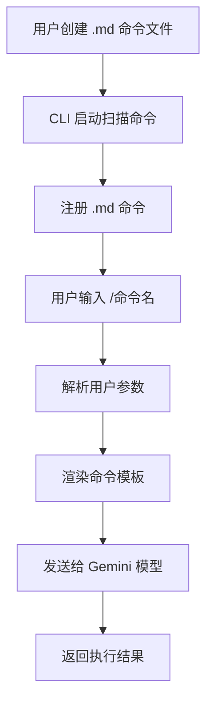

# Gemini CLI 自定义 Markdown 命令功能扩展 - 产品需求文档

## 1. 产品概述

本项目旨在扩展 Gemini CLI 的自定义命令系统，在现有 TOML 格式命令基础上，新增对 Markdown 格式自定义命令的支持。用户可以在项目的 `.gemini/commands/` 目录下创建 `.md` 文件来定义自然语言命令模板，通过 `/` + 命令名的方式快速触发，避免重复输入相同的提示文本。

该功能将显著提升开发者的工作效率，特别是在需要频繁使用特定提示模板的场景下，如代码审查、文档生成、问题排查等。

## 2. 核心功能

### 2.1 用户角色

| 角色 | 使用方式 | 核心权限 |
|------|----------|----------|
| 开发者 | 在项目 .gemini 目录下创建命令文件 | 可创建、编辑、使用项目级自定义命令 |
| 团队成员 | 使用项目中已定义的命令 | 可使用项目中的自定义命令 |

### 2.2 功能模块

本需求包含以下主要功能页面：
1. **命令解析器扩展**：支持 .md 文件格式的命令定义解析
2. **命令执行器增强**：处理 Markdown 格式的命令模板和参数替换
3. **命令发现机制**：自动扫描和注册 .md 格式的自定义命令

### 2.3 页面详情

| 功能模块 | 子模块 | 功能描述 |
|----------|--------|----------|
| 命令解析器 | MD 文件解析 | 解析 .md 文件中的命令元数据和模板内容，支持 YAML Front Matter 格式 |
| 命令解析器 | 格式验证 | 验证 .md 文件格式的正确性，确保必要字段存在 |
| 命令执行器 | 参数替换 | 支持 {{args}} 占位符替换用户输入的参数 |
| 命令执行器 | 模板渲染 | 将 Markdown 内容转换为可执行的提示文本 |
| 命令发现 | 文件扫描 | 扫描 .gemini/commands/ 目录下的 .md 文件 |
| 命令发现 | 命令注册 | 将发现的 .md 命令注册到命令系统中 |

## 3. 核心流程

### 主要用户操作流程：

1. **命令创建流程**：开发者在 `.gemini/commands/` 目录下创建 `.md` 文件，定义命令元数据和模板内容
2. **命令发现流程**：CLI 启动时自动扫描并注册所有 `.md` 格式的自定义命令
3. **命令执行流程**：用户输入 `/命令名 参数`，系统解析参数并渲染模板，发送给 Gemini 模型

## 4. 用户界面设计

### 4.1 设计风格

- **主色调**：保持与现有 Gemini CLI 一致的终端主题色彩
- **交互风格**：命令行界面，简洁明了的文本输出
- **字体**：等宽字体，确保代码和输出的可读性
- **布局风格**：基于现有 CLI 界面，无需额外 UI 组件
- **图标风格**：使用 ASCII 字符和 Unicode 符号

### 4.2 页面设计概览

| 功能模块 | 界面元素 | UI 描述 |
|----------|----------|--------|
| 命令帮助 | 命令列表显示 | 在 `/help` 中显示 .md 命令，标注 [MD] 标识 |
| 命令执行 | 参数提示 | 显示命令描述和参数使用说明 |
| 错误处理 | 错误信息 | 清晰的错误提示，包含文件路径和具体错误原因 |

### 4.3 响应性

该功能为命令行工具扩展，主要在终端环境中使用，无需考虑移动端适配。重点关注不同终端尺寸下的文本显示效果。