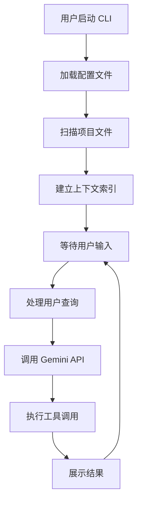
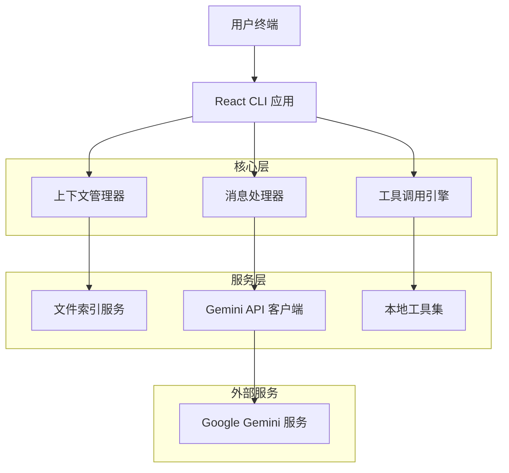
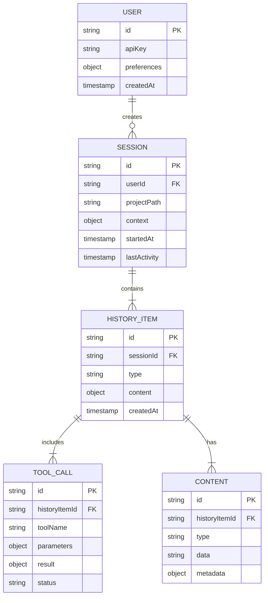

# Gemini CLI 产品需求文档 (PRD)

## 1. 产品概述

Gemini CLI 是一个基于 Google Gemini AI 模型的智能命令行界面工具，旨在为开发者提供强大的 AI 辅助编程体验。该产品通过先进的上下文管理和工具集成机制，实现了高效的人机协作开发模式。

- **核心价值**：通过智能上下文理解和工具调用能力，显著提升开发效率和代码质量
- **目标用户**：专业开发者、技术团队、AI 辅助开发的早期采用者
- **市场定位**：企业级 AI 开发助手，专注于代码生成、项目分析和开发流程优化

## 2. 核心功能

### 2.1 用户角色

| 角色 | 注册方式 | 核心权限 |
|------|----------|----------|
| 开发者用户 | API Key 认证 | 可使用所有 AI 辅助功能、工具调用、项目分析 |
| 企业用户 | 企业账户集成 | 额外的团队协作、配额管理、安全策略配置 |

### 2.2 功能模块

我们的 Gemini CLI 产品包含以下核心页面和功能：

1. **主交互界面**：命令行交互、实时响应显示、工具调用状态
2. **项目上下文管理**：文件索引、代码分析、上下文加载
3. **配置管理界面**：API 配置、主题设置、工具配置
4. **历史记录管理**：会话历史、压缩机制、状态恢复

### 2.3 页面详情

| 页面名称 | 模块名称 | 功能描述 |
|----------|----------|----------|
| 主交互界面 | 命令行输入 | 接收用户输入、支持多行编辑、语法高亮 |
| 主交互界面 | 实时响应显示 | 流式显示 AI 响应、支持 Markdown 渲染、代码高亮 |
| 主交互界面 | 工具调用状态 | 显示工具执行进度、结果预览、错误处理 |
| 项目上下文 | 文件索引器 | 自动扫描项目文件、建立语义索引、支持 .geminiignore |
| 项目上下文 | 代码分析器 | 分析代码结构、提取关键信息、生成上下文摘要 |
| 配置管理 | API 配置 | 管理 Gemini API 密钥、模型选择、参数调优 |
| 配置管理 | 主题设置 | 界面主题切换、颜色方案、字体配置 |
| 历史管理 | 会话历史 | 保存对话记录、支持搜索、导出功能 |
| 历史管理 | 压缩机制 | 智能压缩长对话、保留关键信息、优化性能 |

## 3. 核心流程

用户主要操作流程如下：

1. **初始化流程**：用户启动 CLI → 加载配置 → 建立项目上下文 → 准备接收输入
2. **交互流程**：用户输入查询 → 上下文处理 → AI 模型调用 → 工具执行 → 结果展示
3. **项目分析流程**：扫描项目文件 → 建立语义索引 → 生成上下文摘要 → 缓存优化



## 4. 用户界面设计

### 4.1 设计风格

- **主色调**：深色主题 (#1a1a1a)，辅助色 (#2d2d2d)
- **强调色**：蓝色 (#007acc)，成功绿 (#28a745)，警告橙 (#ffc107)
- **按钮样式**：圆角矩形，悬停效果，渐变背景
- **字体**：等宽字体 (Consolas, Monaco)，大小 14px
- **布局风格**：终端风格，分栏布局，响应式设计
- **图标风格**：线性图标，简洁现代，支持主题切换

### 4.2 页面设计概览

| 页面名称 | 模块名称 | UI 元素 |
|----------|----------|----------|
| 主交互界面 | 命令行输入 | 深色背景，语法高亮，自动补全提示，多行支持 |
| 主交互界面 | 响应显示区 | 流式文本渲染，Markdown 支持，代码块高亮，可折叠区域 |
| 主交互界面 | 工具状态栏 | 进度指示器，状态图标，执行时间，取消按钮 |
| 配置界面 | 设置面板 | 标签页布局，表单控件，实时预览，重置按钮 |

### 4.3 响应式设计

产品采用终端优先设计，支持不同终端尺寸的自适应布局，确保在各种屏幕分辨率下的最佳用户体验。

## 5. 技术架构

### 5.1 架构设计



### 5.2 技术栈

- **前端**：React@18 + TypeScript + Ink (终端 UI)
- **后端**：Node.js + Express (可选，用于企业功能)
- **数据存储**：本地文件系统 + SQLite (历史记录)
- **AI 服务**：Google Gemini API

### 5.3 路由定义

| 路由 | 用途 |
|------|------|
| / | 主交互界面，处理用户输入和 AI 响应 |
| /config | 配置管理界面，设置 API 密钥和偏好 |
| /history | 历史记录查看，支持搜索和导出 |
| /tools | 工具管理界面，配置和测试可用工具 |

### 5.4 核心 API 定义

#### 4.1 上下文管理 API

**获取项目上下文**
```
GET /api/context/project
```

请求参数：
| 参数名 | 参数类型 | 是否必需 | 描述 |
|--------|----------|----------|------|
| path | string | true | 项目根路径 |
| depth | number | false | 扫描深度，默认为 3 |

响应：
| 参数名 | 参数类型 | 描述 |
|--------|----------|------|
| files | Array<FileInfo> | 文件列表和元数据 |
| context | string | 生成的上下文摘要 |

示例：
```json
{
  "path": "/workspace/project",
  "depth": 3
}
```

#### 4.2 消息处理 API

**发送消息到 AI**
```
POST /api/chat/message
```

请求参数：
| 参数名 | 参数类型 | 是否必需 | 描述 |
|--------|----------|----------|------|
| message | string | true | 用户输入消息 |
| context | ContextData | false | 项目上下文数据 |
| history | Array<HistoryItem> | false | 对话历史 |

响应：
| 参数名 | 参数类型 | 描述 |
|--------|----------|------|
| response | string | AI 响应内容 |
| toolCalls | Array<ToolCall> | 工具调用列表 |

## 6. 数据模型

### 6.1 数据模型定义



### 6.2 数据定义语言

**用户表 (users)**
```sql
-- 创建用户表
CREATE TABLE users (
    id TEXT PRIMARY KEY,
    api_key TEXT ENCRYPTED,
    preferences TEXT JSON,
    created_at TIMESTAMP DEFAULT CURRENT_TIMESTAMP
);

-- 创建索引
CREATE INDEX idx_users_created_at ON users(created_at);
```

**会话表 (sessions)**
```sql
-- 创建会话表
CREATE TABLE sessions (
    id TEXT PRIMARY KEY,
    user_id TEXT REFERENCES users(id),
    project_path TEXT NOT NULL,
    context_data TEXT JSON,
    started_at TIMESTAMP DEFAULT CURRENT_TIMESTAMP,
    last_activity TIMESTAMP DEFAULT CURRENT_TIMESTAMP
);

-- 创建索引
CREATE INDEX idx_sessions_user_id ON sessions(user_id);
CREATE INDEX idx_sessions_last_activity ON sessions(last_activity DESC);
```

**历史记录表 (history_items)**
```sql
-- 创建历史记录表
CREATE TABLE history_items (
    id TEXT PRIMARY KEY,
    session_id TEXT REFERENCES sessions(id),
    item_type TEXT NOT NULL CHECK (item_type IN ('user', 'assistant', 'tool')),
    content_data TEXT JSON NOT NULL,
    created_at TIMESTAMP DEFAULT CURRENT_TIMESTAMP
);

-- 创建索引
CREATE INDEX idx_history_session_id ON history_items(session_id);
CREATE INDEX idx_history_created_at ON history_items(created_at DESC);
```

**工具调用表 (tool_calls)**
```sql
-- 创建工具调用表
CREATE TABLE tool_calls (
    id TEXT PRIMARY KEY,
    history_item_id TEXT REFERENCES history_items(id),
    tool_name TEXT NOT NULL,
    parameters TEXT JSON,
    result_data TEXT JSON,
    status TEXT CHECK (status IN ('pending', 'running', 'completed', 'failed', 'cancelled')),
    created_at TIMESTAMP DEFAULT CURRENT_TIMESTAMP,
    completed_at TIMESTAMP
);

-- 创建索引
CREATE INDEX idx_tool_calls_history_item ON tool_calls(history_item_id);
CREATE INDEX idx_tool_calls_status ON tool_calls(status);
```

**初始化数据**
```sql
-- 插入默认配置
INSERT INTO users (id, preferences) VALUES 
('default', '{"theme": "dark", "model": "gemini-pro", "autoSave": true}');

-- 插入示例会话
INSERT INTO sessions (id, user_id, project_path, context_data) VALUES 
('demo-session', 'default', '/workspace/demo', '{"files": [], "summary": "Demo project"}');
```