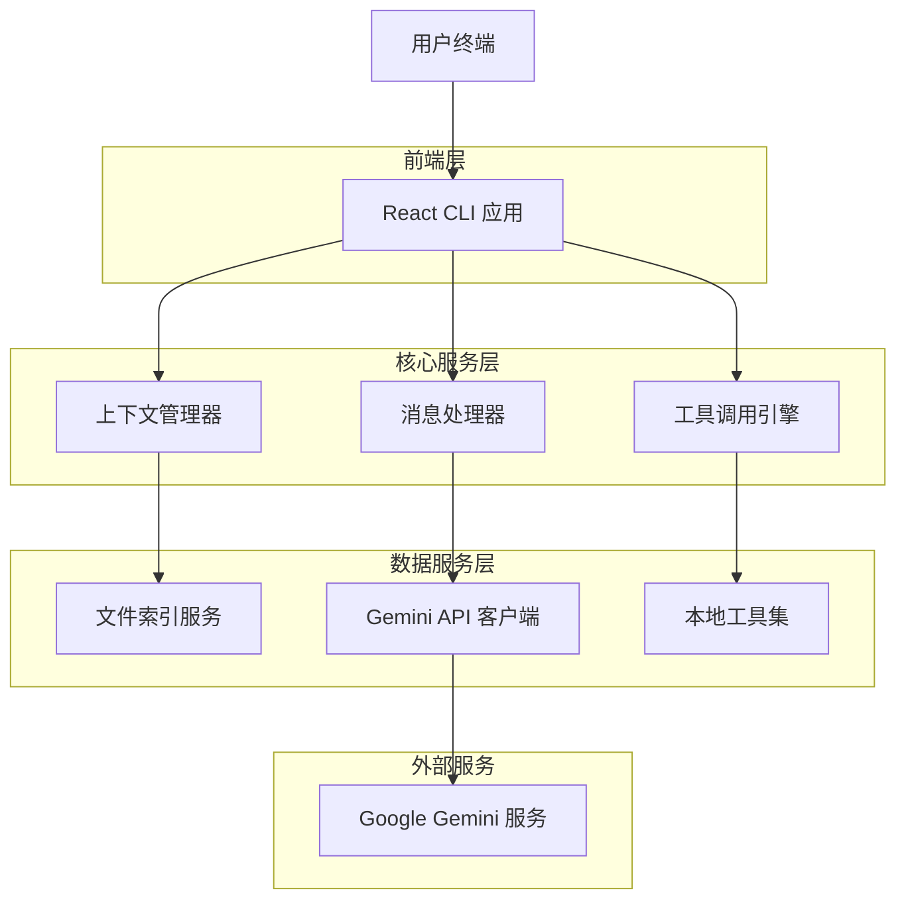
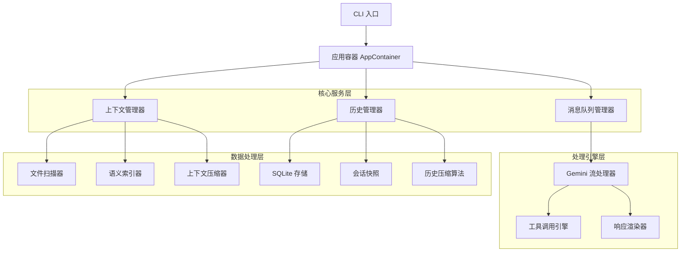
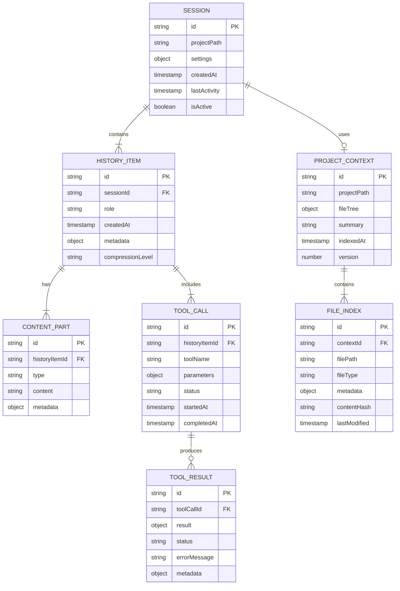

# Gemini CLI 技术架构文档

## 1. 架构设计



## 2. 技术描述

- **前端**: React@18 + TypeScript + Ink@4 + Zustand (状态管理)
- **运行时**: Node.js@18+ + ESM 模块系统
- **数据存储**: SQLite@3 (本地历史) + 文件系统 (项目上下文)
- **AI 服务**: Google Gemini API (gemini-pro, gemini-pro-vision)
- **工具系统**: 内置工具集 + MCP 协议支持

## 3. 路由定义

| 路由 | 用途 |
|------|------|
| / | 主交互界面，处理命令行输入和 AI 流式响应 |
| /config | 配置管理，API 密钥设置和偏好配置 |
| /history | 历史记录浏览，支持搜索和会话恢复 |
| /tools | 工具管理界面，查看和配置可用工具 |
| /context | 项目上下文查看，文件索引和语义分析结果 |

## 4. API 定义

### 4.1 核心消息处理 API

**流式消息处理**
```
POST /api/chat/stream
```

请求参数：
| 参数名 | 参数类型 | 是否必需 | 描述 |
|--------|----------|----------|------|
| message | string | true | 用户输入消息 |
| sessionId | string | true | 会话标识符 |
| context | ProjectContext | false | 项目上下文数据 |
| history | HistoryItem[] | false | 压缩后的对话历史 |

响应（Server-Sent Events）：
| 参数名 | 参数类型 | 描述 |
|--------|----------|------|
| type | string | 事件类型：'content', 'tool_call', 'complete' |
| data | object | 响应数据，根据类型变化 |
| timestamp | number | 事件时间戳 |

示例请求：
```json
{
  "message": "分析这个项目的架构",
  "sessionId": "sess_123",
  "context": {
    "projectPath": "/workspace/project",
    "files": [...],
    "summary": "React TypeScript 项目"
  }
}
```

### 4.2 上下文管理 API

**项目上下文构建**
```
POST /api/context/build
```

请求参数：
| 参数名 | 参数类型 | 是否必需 | 描述 |
|--------|----------|----------|------|
| projectPath | string | true | 项目根目录路径 |
| includePatterns | string[] | false | 包含文件模式 |
| excludePatterns | string[] | false | 排除文件模式 |
| maxDepth | number | false | 最大扫描深度，默认 5 |

响应：
| 参数名 | 参数类型 | 描述 |
|--------|----------|------|
| contextId | string | 上下文标识符 |
| fileCount | number | 扫描到的文件数量 |
| summary | string | 项目结构摘要 |
| indexedAt | timestamp | 索引构建时间 |

### 4.3 工具调用 API

**执行工具调用**
```
POST /api/tools/execute
```

请求参数：
| 参数名 | 参数类型 | 是否必需 | 描述 |
|--------|----------|----------|------|
| toolName | string | true | 工具名称 |
| parameters | object | true | 工具参数 |
| sessionId | string | true | 会话标识符 |
| callId | string | true | 调用标识符 |

响应：
| 参数名 | 参数类型 | 描述 |
|--------|----------|------|
| result | object | 工具执行结果 |
| status | string | 执行状态：'success', 'error', 'cancelled' |
| duration | number | 执行耗时（毫秒） |
| metadata | object | 额外的元数据信息 |

## 5. 服务架构图



## 6. 数据模型

### 6.1 数据模型定义



### 6.2 数据定义语言

**会话表 (sessions)**
```sql
-- 创建会话表
CREATE TABLE sessions (
    id TEXT PRIMARY KEY DEFAULT (hex(randomblob(16))),
    project_path TEXT NOT NULL,
    settings TEXT JSON DEFAULT '{}',
    created_at TIMESTAMP DEFAULT CURRENT_TIMESTAMP,
    last_activity TIMESTAMP DEFAULT CURRENT_TIMESTAMP,
    is_active BOOLEAN DEFAULT 1
);

-- 创建索引
CREATE INDEX idx_sessions_project_path ON sessions(project_path);
CREATE INDEX idx_sessions_last_activity ON sessions(last_activity DESC);
CREATE INDEX idx_sessions_active ON sessions(is_active, last_activity DESC);
```

**历史记录表 (history_items)**
```sql
-- 创建历史记录表
CREATE TABLE history_items (
    id TEXT PRIMARY KEY DEFAULT (hex(randomblob(16))),
    session_id TEXT NOT NULL REFERENCES sessions(id) ON DELETE CASCADE,
    role TEXT NOT NULL CHECK (role IN ('user', 'assistant', 'system')),
    created_at TIMESTAMP DEFAULT CURRENT_TIMESTAMP,
    metadata TEXT JSON DEFAULT '{}',
    compression_level TEXT DEFAULT 'none' CHECK (compression_level IN ('none', 'partial', 'full'))
);

-- 创建索引
CREATE INDEX idx_history_session_id ON history_items(session_id, created_at);
CREATE INDEX idx_history_role ON history_items(role);
CREATE INDEX idx_history_compression ON history_items(compression_level);
```

**内容部分表 (content_parts)**
```sql
-- 创建内容部分表
CREATE TABLE content_parts (
    id TEXT PRIMARY KEY DEFAULT (hex(randomblob(16))),
    history_item_id TEXT NOT NULL REFERENCES history_items(id) ON DELETE CASCADE,
    type TEXT NOT NULL CHECK (type IN ('text', 'image', 'file', 'code')),
    content TEXT NOT NULL,
    metadata TEXT JSON DEFAULT '{}'
);

-- 创建索引
CREATE INDEX idx_content_history_item ON content_parts(history_item_id);
CREATE INDEX idx_content_type ON content_parts(type);
```

**工具调用表 (tool_calls)**
```sql
-- 创建工具调用表
CREATE TABLE tool_calls (
    id TEXT PRIMARY KEY DEFAULT (hex(randomblob(16))),
    history_item_id TEXT NOT NULL REFERENCES history_items(id) ON DELETE CASCADE,
    tool_name TEXT NOT NULL,
    parameters TEXT JSON NOT NULL,
    status TEXT DEFAULT 'pending' CHECK (status IN ('pending', 'running', 'completed', 'failed', 'cancelled')),
    started_at TIMESTAMP DEFAULT CURRENT_TIMESTAMP,
    completed_at TIMESTAMP
);

-- 创建索引
CREATE INDEX idx_tool_calls_history_item ON tool_calls(history_item_id);
CREATE INDEX idx_tool_calls_status ON tool_calls(status);
CREATE INDEX idx_tool_calls_tool_name ON tool_calls(tool_name);
```

**工具结果表 (tool_results)**
```sql
-- 创建工具结果表
CREATE TABLE tool_results (
    id TEXT PRIMARY KEY DEFAULT (hex(randomblob(16))),
    tool_call_id TEXT NOT NULL REFERENCES tool_calls(id) ON DELETE CASCADE,
    result TEXT JSON,
    status TEXT NOT NULL CHECK (status IN ('success', 'error', 'partial')),
    error_message TEXT,
    metadata TEXT JSON DEFAULT '{}'
);

-- 创建索引
CREATE INDEX idx_tool_results_call_id ON tool_results(tool_call_id);
CREATE INDEX idx_tool_results_status ON tool_results(status);
```

**项目上下文表 (project_contexts)**
```sql
-- 创建项目上下文表
CREATE TABLE project_contexts (
    id TEXT PRIMARY KEY DEFAULT (hex(randomblob(16))),
    project_path TEXT UNIQUE NOT NULL,
    file_tree TEXT JSON NOT NULL,
    summary TEXT,
    indexed_at TIMESTAMP DEFAULT CURRENT_TIMESTAMP,
    version INTEGER DEFAULT 1
);

-- 创建索引
CREATE INDEX idx_contexts_project_path ON project_contexts(project_path);
CREATE INDEX idx_contexts_indexed_at ON project_contexts(indexed_at DESC);
```

**文件索引表 (file_indexes)**
```sql
-- 创建文件索引表
CREATE TABLE file_indexes (
    id TEXT PRIMARY KEY DEFAULT (hex(randomblob(16))),
    context_id TEXT NOT NULL REFERENCES project_contexts(id) ON DELETE CASCADE,
    file_path TEXT NOT NULL,
    file_type TEXT,
    metadata TEXT JSON DEFAULT '{}',
    content_hash TEXT,
    last_modified TIMESTAMP
);

-- 创建索引
CREATE INDEX idx_file_indexes_context_id ON file_indexes(context_id);
CREATE INDEX idx_file_indexes_file_path ON file_indexes(file_path);
CREATE INDEX idx_file_indexes_file_type ON file_indexes(file_type);
CREATE INDEX idx_file_indexes_hash ON file_indexes(content_hash);
```

**初始化数据**
```sql
-- 插入默认会话配置
INSERT INTO sessions (id, project_path, settings) VALUES 
('default-session', '/workspace', '{"model": "gemini-pro", "temperature": 0.7, "maxTokens": 4096}');

-- 插入系统消息模板
INSERT INTO history_items (id, session_id, role, metadata) VALUES 
('system-prompt', 'default-session', 'system', '{"type": "system_prompt", "version": "1.0"}');

INSERT INTO content_parts (history_item_id, type, content) VALUES 
('system-prompt', 'text', 'You are a helpful AI assistant specialized in software development.');
```