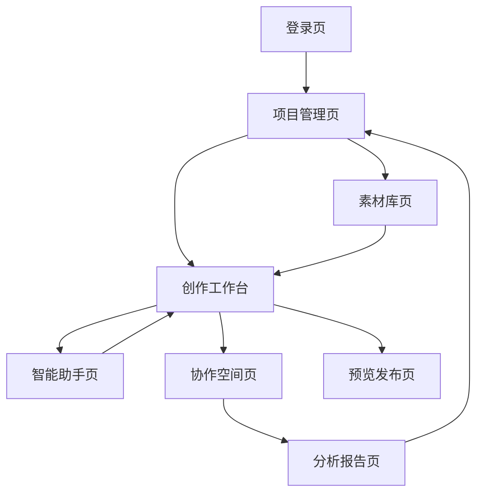

# 小说软件全能辅助Agent系统 - 产品需求文档

## 1. 产品概述

本产品是一个专门为小说创作软件设计的智能辅助系统，基于多智能体协作架构，为作者提供从创意构思到作品完成的全流程智能辅助服务。系统通过简化的任务调度机制和专业化的智能体团队，帮助作者提升创作效率和作品质量。

- 核心目标：为小说作者提供智能化的创作辅助工具，涵盖情节构思、人物设定、文本创作、编辑润色等全流程服务
- 目标用户：网络小说作者、传统文学创作者、编剧、内容创作者
- 市场价值：通过AI技术降低创作门槛，提升创作效率，帮助作者专注于核心创意表达

## 2. 核心功能

### 2.1 用户角色

| 角色 | 注册方式 | 核心权限 |
|------|----------|----------|
| 普通作者 | 邮箱注册 | 基础创作辅助、文本生成、简单编辑功能 |
| 专业作者 | 付费升级 | 高级创作工具、多智能体协作、项目管理、数据分析 |
| 编辑 | 邀请注册 | 作品审阅、批注建议、质量评估、协作编辑 |

### 2.2 功能模块

本小说辅助系统包含以下核心页面：

1. **创作工作台**：智能写作界面、实时辅助建议、多智能体协作面板
2. **项目管理页**：作品管理、章节规划、进度跟踪、版本控制
3. **智能助手页**：智能体配置、任务调度、辅助工具集成
4. **素材库页**：人物设定、世界观管理、情节模板、参考资料
5. **分析报告页**：创作数据分析、作品质量评估、读者反馈统计
6. **协作空间页**：多人协作、评论批注、版本对比、讨论区

### 2.3 页面详情

| 页面名称 | 模块名称 | 功能描述 |
|----------|----------|----------|
| 创作工作台 | 智能编辑器 | 支持markdown和富文本编辑，实时语法检查，智能续写建议 |
| 创作工作台 | AI助手面板 | 显示当前活跃的智能体，提供创作建议，支持多轮对话 |
| 创作工作台 | 实时协作区 | 多智能体实时协作状态，任务进度显示，结果预览 |
| 项目管理页 | 作品列表 | 创建、删除、归档作品项目，支持标签分类和搜索 |
| 项目管理页 | 章节大纲 | 树形结构章节管理，拖拽排序，进度统计，字数统计 |
| 项目管理页 | 版本历史 | 自动保存版本，手动创建里程碑，版本对比和回滚 |
| 智能助手页 | 智能体管理 | 查看可用智能体，配置智能体参数，自定义智能体行为 |
| 智能助手页 | 任务调度器 | 创建复合任务，监控执行进度，查看执行结果 |
| 智能助手页 | 工具集成 | 集成外部API，自定义工具链，批量处理功能 |
| 素材库页 | 人物档案 | 创建和管理角色信息，关系图谱，性格分析 |
| 素材库页 | 世界观设定 | 背景设定，地图管理，时间线，设定一致性检查 |
| 素材库页 | 情节模板 | 预设情节模板，自定义模板，情节生成器 |
| 分析报告页 | 创作统计 | 字数统计，创作时间分析，效率趋势图 |
| 分析报告页 | 质量评估 | AI质量评分，文本分析报告，改进建议 |
| 分析报告页 | 读者反馈 | 评论收集，情感分析，热点话题识别 |
| 协作空间页 | 评论系统 | 段落级评论，批注建议，讨论串联 |
| 协作空间页 | 协作编辑 | 实时多人编辑，冲突解决，权限管理 |
| 协作空间页 | 审阅流程 | 提交审阅，状态跟踪，批准发布 |

## 3. 核心流程

### 普通作者创作流程
1. 登录系统 → 创建新项目 → 设置基本信息
2. 进入创作工作台 → 激活智能助手 → 开始创作
3. 使用AI辅助生成大纲 → 逐章节创作 → 实时获得建议
4. 保存作品 → 查看分析报告 → 优化改进

### 专业作者协作流程
1. 创建复杂项目 → 配置多智能体团队 → 设置协作规则
2. 分解创作任务 → 智能体并行工作 → 监控进度
3. 整合智能体输出 → 人工审核编辑 → 版本管理
4. 邀请编辑协作 → 收集反馈 → 迭代优化

### 页面导航流程图

## 4. 用户界面设计

### 4.1 设计风格

- **主色调**：深蓝色(#1e3a8a)作为主色，温暖橙色(#f59e0b)作为强调色
- **辅助色**：浅灰色(#f8fafc)背景，深灰色(#374151)文字
- **按钮风格**：圆角矩形按钮，渐变效果，悬停动画
- **字体**：中文使用"思源黑体"，英文使用"Inter"，代码使用"JetBrains Mono"
- **布局风格**：左侧导航 + 主内容区域，卡片式组件设计
- **图标风格**：线性图标为主，配合少量填充图标，统一使用Heroicons图标库

### 4.2 页面设计概览

| 页面名称 | 模块名称 | UI元素 |
|----------|----------|--------|
| 创作工作台 | 智能编辑器 | 全屏编辑器，工具栏悬浮，字数统计右下角，深色/浅色主题切换 |
| 创作工作台 | AI助手面板 | 右侧滑出面板，智能体头像+状态指示，对话气泡样式，快捷操作按钮 |
| 项目管理页 | 作品列表 | 网格卡片布局，封面缩略图，进度条，标签云，搜索过滤器 |
| 智能助手页 | 智能体管理 | 智能体卡片网格，能力雷达图，配置抽屉，状态指示灯 |
| 素材库页 | 人物档案 | 左侧人物列表，右侧详情面板，关系图谱可视化，标签分类 |
| 分析报告页 | 数据可视化 | 图表组件，时间选择器，数据导出按钮，趋势分析图 |

### 4.3 响应式设计

- **桌面优先**：主要面向桌面端创作场景，1920x1080分辨率优化
- **平板适配**：支持iPad等平板设备，触控优化，手势操作
- **移动端**：提供移动端查看和简单编辑功能，响应式布局