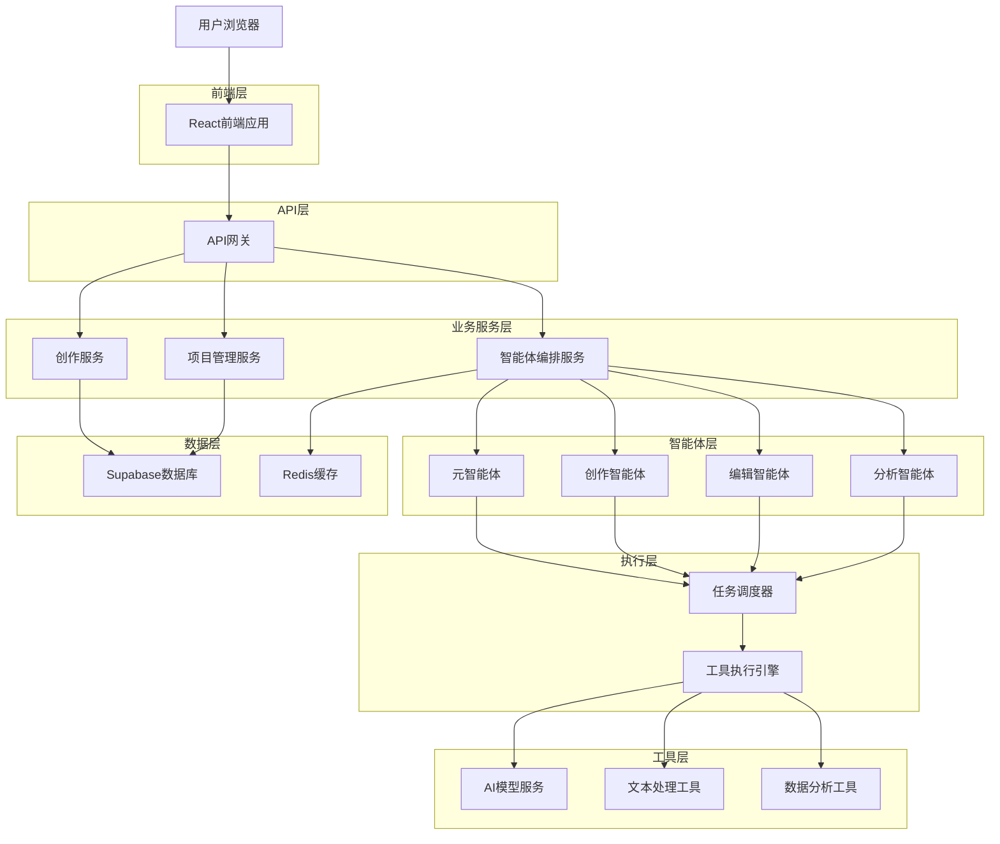
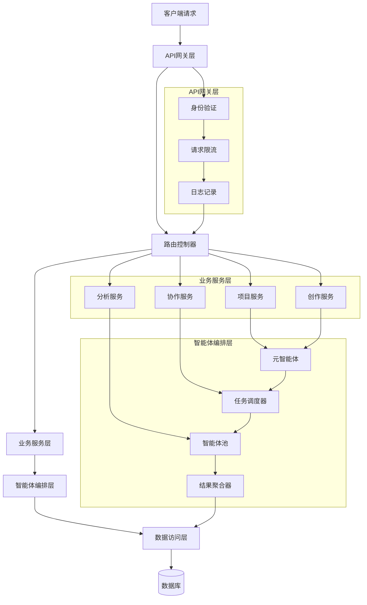
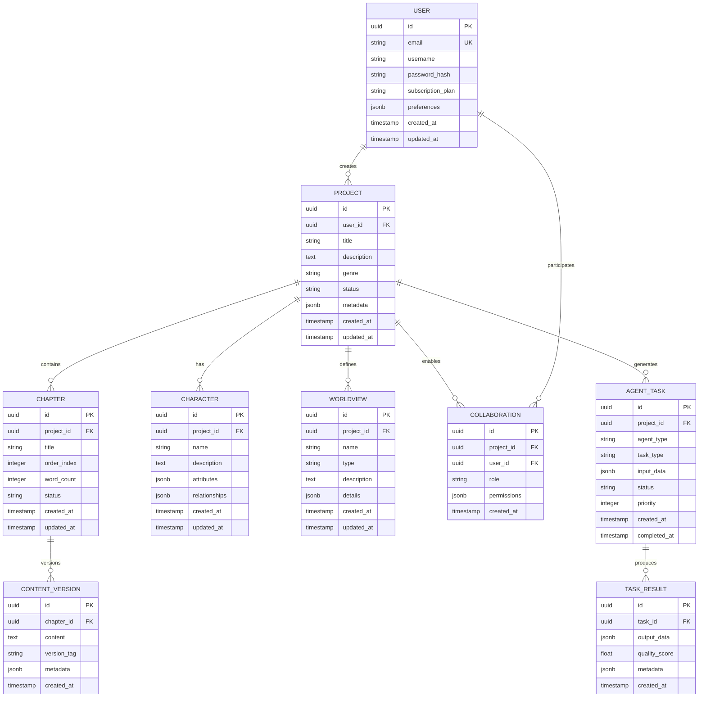

# 小说软件全能辅助Agent系统 - 技术架构文档

## 1. 架构设计



## 2. 技术描述

- **前端**: React@18 + TypeScript + Tailwind CSS + Vite
- **后端**: Node.js + Express + TypeScript
- **数据库**: Supabase (PostgreSQL)
- **缓存**: Redis
- **AI服务**: OpenAI GPT-4 / Claude / 本地模型

## 3. 路由定义

| 路由 | 用途 |
|------|------|
| / | 首页，项目概览和快速访问 |
| /login | 登录页面，支持邮箱和第三方登录 |
| /register | 注册页面，用户信息收集 |
| /dashboard | 项目管理仪表板，作品列表和统计 |
| /workspace/:projectId | 创作工作台，主要创作界面 |
| /agents | 智能助手管理页面，配置和监控智能体 |
| /library/:projectId | 素材库页面，管理创作素材 |
| /analytics/:projectId | 分析报告页面，数据可视化 |
| /collaborate/:projectId | 协作空间，多人协作功能 |
| /settings | 用户设置，个人偏好配置 |

## 4. API定义

### 4.1 核心API

#### 用户认证相关
```
POST /api/auth/login
```

请求参数：
| 参数名 | 参数类型 | 是否必需 | 描述 |
|--------|----------|----------|------|
| email | string | true | 用户邮箱 |
| password | string | true | 用户密码 |

响应参数：
| 参数名 | 参数类型 | 描述 |
|--------|----------|------|
| success | boolean | 登录是否成功 |
| token | string | JWT访问令牌 |
| user | object | 用户基本信息 |

示例：
```json
{
  "email": "author@example.com",
  "password": "password123"
}
```

#### 项目管理相关
```
GET /api/projects
POST /api/projects
PUT /api/projects/:id
DELETE /api/projects/:id
```

#### 智能体服务相关
```
POST /api/agents/execute
GET /api/agents/status
POST /api/agents/configure
```

请求参数（智能体执行）：
| 参数名 | 参数类型 | 是否必需 | 描述 |
|--------|----------|----------|------|
| agentType | string | true | 智能体类型 |
| task | object | true | 任务描述 |
| context | object | false | 上下文信息 |
| priority | string | false | 任务优先级 |

#### 创作服务相关
```
POST /api/writing/generate
POST /api/writing/edit
POST /api/writing/analyze
```

#### 协作服务相关
```
GET /api/collaborate/:projectId/comments
POST /api/collaborate/:projectId/comments
PUT /api/collaborate/:projectId/comments/:commentId
```

## 5. 服务架构图



## 6. 数据模型

### 6.1 数据模型定义



### 6.2 数据定义语言

#### 用户表 (users)
```sql
-- 创建用户表
CREATE TABLE users (
    id UUID PRIMARY KEY DEFAULT gen_random_uuid(),
    email VARCHAR(255) UNIQUE NOT NULL,
    username VARCHAR(100) NOT NULL,
    password_hash VARCHAR(255) NOT NULL,
    subscription_plan VARCHAR(20) DEFAULT 'free' CHECK (subscription_plan IN ('free', 'pro', 'enterprise')),
    preferences JSONB DEFAULT '{}',
    created_at TIMESTAMP WITH TIME ZONE DEFAULT NOW(),
    updated_at TIMESTAMP WITH TIME ZONE DEFAULT NOW()
);

-- 创建索引
CREATE INDEX idx_users_email ON users(email);
CREATE INDEX idx_users_subscription ON users(subscription_plan);
```

#### 项目表 (projects)
```sql
-- 创建项目表
CREATE TABLE projects (
    id UUID PRIMARY KEY DEFAULT gen_random_uuid(),
    user_id UUID NOT NULL REFERENCES users(id) ON DELETE CASCADE,
    title VARCHAR(255) NOT NULL,
    description TEXT,
    genre VARCHAR(50),
    status VARCHAR(20) DEFAULT 'draft' CHECK (status IN ('draft', 'writing', 'editing', 'completed', 'published')),
    metadata JSONB DEFAULT '{}',
    created_at TIMESTAMP WITH TIME ZONE DEFAULT NOW(),
    updated_at TIMESTAMP WITH TIME ZONE DEFAULT NOW()
);

-- 创建索引
CREATE INDEX idx_projects_user_id ON projects(user_id);
CREATE INDEX idx_projects_status ON projects(status);
CREATE INDEX idx_projects_genre ON projects(genre);
```

#### 章节表 (chapters)
```sql
-- 创建章节表
CREATE TABLE chapters (
    id UUID PRIMARY KEY DEFAULT gen_random_uuid(),
    project_id UUID NOT NULL REFERENCES projects(id) ON DELETE CASCADE,
    title VARCHAR(255) NOT NULL,
    order_index INTEGER NOT NULL,
    word_count INTEGER DEFAULT 0,
    status VARCHAR(20) DEFAULT 'draft',
    created_at TIMESTAMP WITH TIME ZONE DEFAULT NOW(),
    updated_at TIMESTAMP WITH TIME ZONE DEFAULT NOW(),
    UNIQUE(project_id, order_index)
);

-- 创建索引
CREATE INDEX idx_chapters_project_id ON chapters(project_id);
CREATE INDEX idx_chapters_order ON chapters(project_id, order_index);
```

#### 智能体任务表 (agent_tasks)
```sql
-- 创建智能体任务表
CREATE TABLE agent_tasks (
    id UUID PRIMARY KEY DEFAULT gen_random_uuid(),
    project_id UUID REFERENCES projects(id) ON DELETE CASCADE,
    agent_type VARCHAR(50) NOT NULL,
    task_type VARCHAR(50) NOT NULL,
    input_data JSONB NOT NULL,
    status VARCHAR(20) DEFAULT 'pending' CHECK (status IN ('pending', 'running', 'completed', 'failed', 'cancelled')),
    priority INTEGER DEFAULT 5 CHECK (priority BETWEEN 1 AND 10),
    created_at TIMESTAMP WITH TIME ZONE DEFAULT NOW(),
    completed_at TIMESTAMP WITH TIME ZONE
);

-- 创建索引
CREATE INDEX idx_agent_tasks_project_id ON agent_tasks(project_id);
CREATE INDEX idx_agent_tasks_status ON agent_tasks(status);
CREATE INDEX idx_agent_tasks_priority ON agent_tasks(priority DESC, created_at);
```

#### 初始化数据
```sql
-- 插入示例用户
INSERT INTO users (email, username, password_hash, subscription_plan) VALUES
('demo@example.com', '示例作者', '$2b$10$example_hash', 'pro'),
('editor@example.com', '编辑用户', '$2b$10$example_hash', 'enterprise');

-- 插入示例项目
INSERT INTO projects (user_id, title, description, genre, status) 
SELECT 
    u.id,
    '我的第一部小说',
    '这是一个关于冒险的故事',
    '奇幻',
    'writing'
FROM users u WHERE u.email = 'demo@example.com';
```